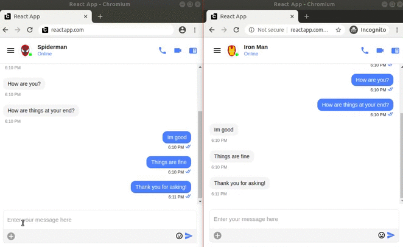

# React tutorial for typing indicators

## Introduction

In this tutorial, you will find the steps you need to add chat functionality alongwith typing indicators using our React UI Kit to your React project.

React Chat UI Kit is a collection of custom UI Components and UI Screens designed to build chat application with fully customizable UI. It is designed to avoid boilerplate code for building UI. 

## Before getting started

This section shows you the pre-requisites you need for integrating CometChat for your react app.

### Requirements
 1. [CometChat Account](#cometchat-account)

    ### CometChat Account
    To use this library, you need application keys from your CometChat account. If you don't have an account, you can create one <a href="https://app.cometchat.com/" target="_blank">here</a>.

    1. Sign in to your <a href="https://app.cometchat.com/" target="_blank">CometChat Dashboard</a>
    2. Click **Add New App**
    3. Give your app a name, and select a region and click  Add App
    4. Click your new app to open its settings.
    5. Locate API Keys and Create Auth Key. You'll need `App ID`, `Auth Key` and `Region`

 2. React application setup


### Installation

1. Install CometChat SDK

```javascript
    npm install @cometchat-pro/chat@2.1.4 --save
```

2. Setting up the CometChat UI KIT 

    1. Clone the repository
        ```javascript
        git clone https://github.com/cometchat-pro/javascript-react-chat-ui-kit.git
        ```
    2. Copy CometChat folder to your source folder. 
    3. Copy the dependencies from the UI Kit's package.json to your project's package.json file. 
    4. To install the dependencies, run
        ```javascript
            npm install
        ```

## Getting started

### Specify the App ID
By navigating to our src/constants folder replace `APP_ID`, `APP_REGION`, `AUTH_KEY` with your CometChat `APP ID`, `REGION` and `Auth Key` in constants.js


### Initialize CometChat

```javascript
    import { CometChat } from "@cometchat-pro/"
```

The `init()` method initializes the settings required for CometChat.
We suggest calling the `init()` method on app startup, preferably in the `onCreate()` method of the Application class.
```javascript
    import * as CONSTANTS from "./constants/constants";

    const appSetting = new CometChat.AppSettingsBuilder().subscribePresenceForAllUsers().setRegion(CONSTANTS.APP_REGION).build();
    CometChat.init(CONSTANTS.APP_ID, appSetting).then(() => {
        console.log("Initialization completed successfully");
        // You can now call login function.
    },
    error => {
        console.log("Initialization failed with error:", error);
        // Check the reason for error and take appropriate action.
    });
```

### Create login component

Once initialization is successful, you need to create Login component. 
This login component can be found by navigating to the src/components folder. 

It allows us to log into CometChat using the default users provided (superhero1, superhero2, superhero3) or by registering a new user through an input field which is provided. Upon submission of the input or click of one of the default users we trigger the login().
If the user is already registered, we trigger the CometChat.login() which authenticates our user.
Then, we redirect the user to the Message component.


### Create message component
This message component can be found by navigating to the src/components folder. 

On mount of this component, we get our logged in user. 
We then import the CometChatGroupListScreen component from the CometChat UI Kit we cloned earlier. This component will list all groups and also handle all the logic of sending and receiving messages with typing indicators from group members.

When you start typing in a message, the other user will be able to see the text `typing...` in his chat window below your name. The image below will describe the process.



### Testing Our Application
To test our application, run the following command
```javascript
    npm start
```
Open http://localhost:3000 to view it in the browser.

## Reference
Please refer our [documentation](https://prodocs.cometchat.com/docs/react-ui-kit) for more information about how to integrate UI Kit to your applications.